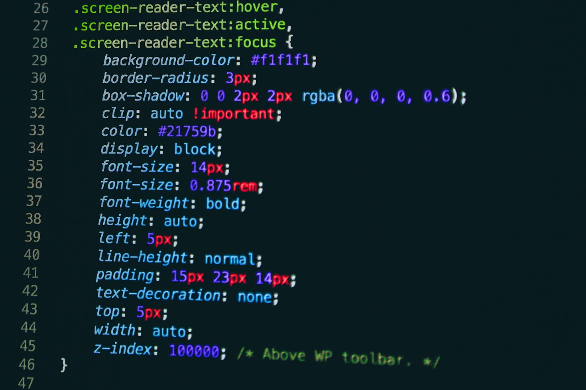

# Tawana Msebele Portfolio

## Overview

This portfolio website is a personal project created by Tawana Msebele as part of an assignment for the Software Development Scholarship with Powerlearn Project. The site showcases my skills, projects, and background as a 37-year-old software developer with a passion for technology and innovation. It serves as a professional representation of my journey in software development, highlighting my expertise in HTML, CSS, JavaScript, IT support, generative AI, and cloud computing.

The site features a modern design with a dark slate gray gradient background, a CSS-generated code snippet overlay, and custom icons for section headings. It includes sections for an introduction, skills, projects, a functional contact form, and contact information, with a unique header and a modernized footer.

## Features

- **Responsive Design**: Built with HTML, CSS, and JavaScript to ensure a clean layout on various screen sizes.
- **Custom Background**: A dark slate gray gradient with a CSS-generated code snippet overlay, reflecting my software development focus.
- **Unique Header**: Left-aligned header with a vertical accent line for a modern, asymmetrical look.
- **Modern Footer**: Gradient background with contact details and placeholder social media links (GitHub, LinkedIn).
- **Section Icons**: Unicode icons for "About Me," "Skills," and "Projects" headings to enhance visual appeal.
- **Project Showcase**: Displays three projects with placeholder images, reflecting my work in software development, cloud computing, and IT support.
- **Functional Contact Form**: A form allowing users to input their name, cell number, email, and a message, integrated with Formspree for submission and JavaScript for validation and feedback.

## Technologies Used

- **HTML5**: For structuring the content of the site.
- **CSS3**: For styling, including gradients, hover effects, and the code snippet background.
- **JavaScript**: For form validation and handling submission with the Fetch API.
- **Formspree**: Third-party service for handling form submissions without a backend.
- **Google Fonts**: Used the "Roboto" font for a clean, professional typography.
- **VS Code**: Development environment for coding and testing.
- **Git & GitHub**: Version control and hosting of the project repository.
- **Vercel**: Deployment platform for hosting the live site.

## Project Structure
portfolio/
├── index.html              # Main HTML file for the portfolio site
├── styles.css              # CSS file for styling the site
├── script.js               # JavaScript file for form handling
├── portfolio-image.jpg     # Placeholder image for the Portfolio Website project
├── cloud-image.jpg         # Placeholder image for the Cloud Resource Dashboard project
├── extra-image.jpg         # Placeholder image for the IT Support System Layout project
└── README.md               # Project documentation

